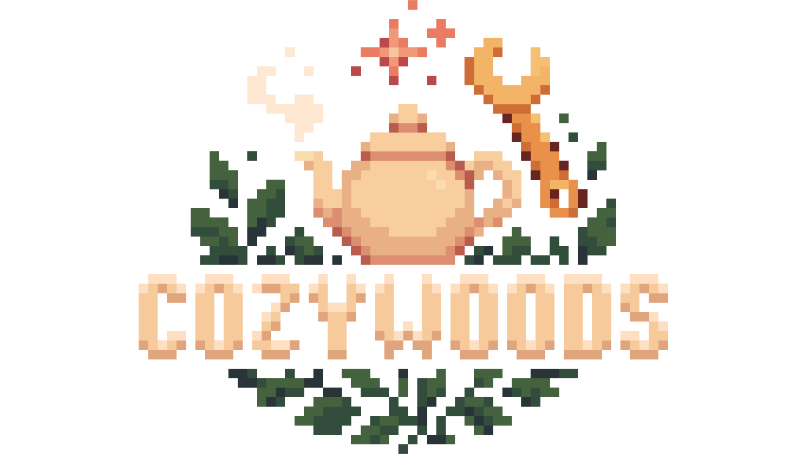

# 🌲 Cozywoods

**A cozy, magical, exploration-driven modpack built on Forge 1.20.1**  
*Home is where the teapot whistles and the toolbench hums.*

---

## ✨ About

Cozywoods is a warm, immersive modpack focused on relaxed exploration, creative building, and magical discovery — all while staying cozy. Whether you're setting up a teahouse in a foggy forest, crafting contraptions with Create, or brewing strange potions deep underground, this pack is about atmosphere and storytelling.

---

## 🧱 Features

- 🧭 **Exploration**: Discover magical biomes, secret caves, and whimsical dimensions  
- 🔧 **Create Mod**: Design, build and automate with kinetic machines  
- ✨ **Magic**: From gentle herbalism to ancient sorcery  
- 🏡 **Building & Farming**: Cozy cottages, seasonal crops, and food variety  
- 📚 **Questing**: Optional questlines for gentle guidance (via FTB Quests)  

---

## 📦 Get the Pack

Modrinth
Curseforge

> ❗ Java 17+ required  
> 🖥️ Recommended: 8 GB RAM

---

## 🧩 Modpack Philosophy

Cozywoods is curated to be:

- **Low-stress**: No grindy progression walls  
- **Highly configurable**: Built with KubeJS, Datapacks & Patchouli  
- **Playable solo or with friends**  
- **Perfect for casual roleplay or seasonal servers**

---

## 📚 Credits

All mods are property of their respective authors.  
Modpack design, art & configuration by the **Cozywoods Team**.  
Special thanks to the creators of:

- `Create`, `Farmer's Delight`, `Let's Do`, and more  
- Design by DefinitivTim
- Additional quest writing and feedback by the community ❤️

---

## 📄 License

This project is licensed under the [MIT License](LICENSE).  
Individual mods are licensed separately by their respective authors.  
Please do not redistribute the modpack with changes outside official release channels.

---

## 🌐 Contact & Community

Join our [Discord](https://discord.gg/definitivtim)  
Issues? Suggestions? Feel free to open an [Issue](https://github.com/cozywoods/issues)

---

Happy crafting, wandering, and tea brewing! 🍵
